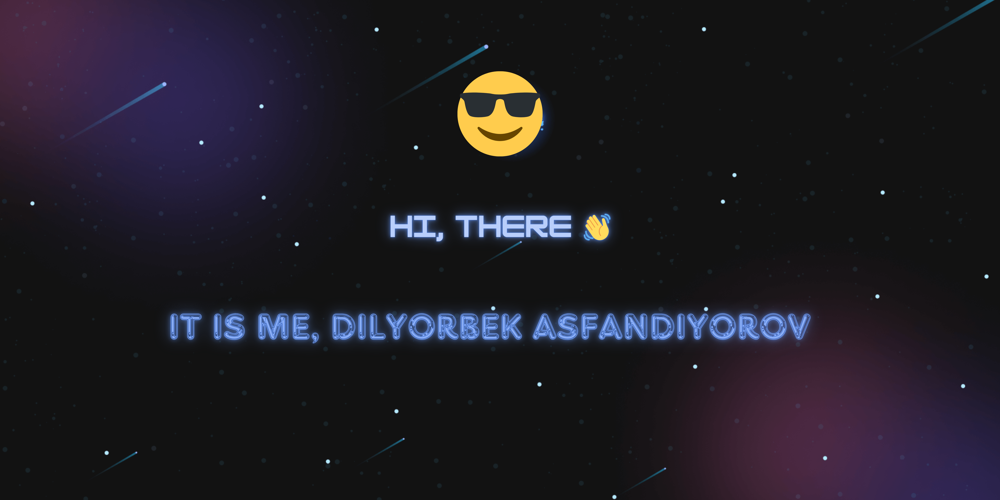

<!--Banner-->

<!--Night Owl image-->

  

<!--Header Name-->
#  ɪ'ᴍ ᴋɪʀᴀɴ! 
*Digital Craftsman (Developer / Programmer)*
  

<!--Start Intro-->               

I am a Full Stack Developer and Machine Learning Enthusiast with a huge love for Python, React.js, Node.js, Django, RDBMS, REST API and Data Visualization. 

- ✨ Student of life :)
- 🌱 I’m currently learning many things, I believe that everyday is a learning opportunity.
- 💁‍♂️ Trusted member and Moderator at [DEV Community](https://dev.to)
- 🏙 A lifetime insider and Mentor at [Exercism](https://exercism.org/profiles/Kiran1689).
- ✍ I write technical blogs, You can visit my blog site at [DEV](https://dev.to/dev_kiran).
- ❤ Contributing to Open Source.
- 💻 Visit my [Portfolio](https://kiran1689.github.io) for more details about me.
<!--End Intro-->

<!--Profile Count Badge-->

  

---
 

<!--Languages and Tools Section-->       
<h2 align="center">Lᴀɴɢᴜᴀɢᴇs ᴀɴᴅ Tᴏᴏʟs</h2> 

 

<!--Trophies Section-->   
<h2 align="center">🏆 Gɪᴛʜᴜʙ Tʀᴏᴘʜɪᴇs 🏆</h2>

  

 

<!--Github stats Table--> 
<h2 align="center">📊 Gɪᴛʜᴜʙ Sᴛᴀᴛs 📊</h2>

<table width="100%">
  <tr>
    <td width="50%">
      <h3 align="center"><strong>Gɪᴛʜᴜʙ Sᴛᴀᴛs</strong></h3>
      

        
      

    </td>
    <td width="50%">
      <h3 align="center"><strong>Sᴛʀᴇᴀᴋ Sᴛᴀᴛs</strong></h3>
      

        
      

    </td>
  </tr>
  <tr>
    <td width="50%">
      <h3 align="center"><strong>Lᴀᴛᴇsᴛ Pʀᴏᴊᴇᴄᴛ</strong></h3>
      

        
      

    </td>
    <td width="50%">
      <h3 align="center"><strong>Tᴏᴘ Cᴏɴᴛʀɪʙᴜᴛɪᴏɴs</strong></h3>
      

        
      

    </td>
  </tr>
</table>
 

<!--Contribution Graph-->
<h2 align="center">📈 Cᴏɴᴛʀɪʙᴜᴛɪᴏɴ Gʀᴀᴘʜ 📈</h2>

    

---

<!--Dynamic Quote card updated everyday at 12 PM--> 
<h2 align="center">🌟 Tʜᴏᴜɢʜᴛ ᴏғ ᴛʜᴇ Dᴀʏ 🌟</h2>

<!--STARTS_HERE_QUOTE_CARD-->

    

<!--ENDS_HERE_QUOTE_CARD-->

<!--Contact Section--> 

<h2 align="center">🤝 Cᴏɴɴᴇᴄᴛ Wɪᴛʜ Mᴇ 🤝 </h2>

 
  

 

<!--Buy me a coffee-->

<!--Footer--> 

  

# Your Name

## Hi there! 👋

🌟 Welcome to my GitHub profile! 🌟

I'm passionate about coding and open source. Here you'll find some of my personal projects, contributions to various open source projects, and more.

### 🔭 Current Projects

🚀 [Project 1](https://github.com/your-username/project-1): Brief description of the project.

🚀 [Project 2](https://github.com/your-username/project-2): Brief description of the project.

🚀 [Project 3](https://github.com/your-username/project-3): Brief description of the project.

### 🌱 I'm Currently Learning

📚 I'm always eager to learn new technologies and improve my skills. Currently, I'm focusing on:

- Language 1
- Technology 2
- Framework 3

### 📫 How to Reach Me

📧 Feel free to reach out to me:

- Website: [your-website.com](https://www.your-website.com)
- Email: your-email@example.com

### 💬 Ask Me About

❓ Feel free to ask me about anything related to:

- Technology/Tool 1
- Technology/Tool 2
- Technology/Tool 3

### ⚡ Fun Fact

🎉 Here's a fun fact about me: [Insert fun fact here]

### 📚 Latest Blog Posts

📝 Check out some of my latest blog posts:

- [Title of Blog Post 1](https://your-blog.com/post-1): Brief description of the blog post.

- [Title of Blog Post 2](https://your-blog.com/post-2): Brief description of the blog post.

- [Title of Blog Post 3](https://your-blog.com/post-3): Brief description of the blog post.

### 🤝 Let's Connect

🌐 I enjoy connecting with fellow developers and tech enthusiasts. You can find me on different platforms:

- [GitHub](https://github.com/your-username)
- [Twitter](https://twitter.com/your-twitter-handle)
- [LinkedIn](https://www.linkedin.com/in/your-linkedin-profile)

Thank you for visiting my profile! 😄 Feel free to explore my repositories and reach out to me. I'm looking forward to connecting with you. 🤝

# end task

# Your Name

## Hi there! 👋

I'm passionate about coding and open source. Welcome to my GitHub profile! Here you'll find some of my personal projects, contributions to various open source projects, and more.

### 🔭 Current Projects

- [Project 1](https://github.com/your-username/project-1): Brief description of the project.
- [Project 2](https://github.com/your-username/project-2): Brief description of the project.
- [Project 3](https://github.com/your-username/project-3): Brief description of the project.

### 🌱 I'm Currently Learning

I'm always eager to learn new technologies and improve my skills. Currently, I'm focusing on:

- Language 1
- Technology 2
- Framework 3

### 📫 How to Reach Me

- Website: [your-website.com](https://www.your-website.com)
- Email: your-email@example.com

### 💬 Ask Me About

Feel free to ask me about anything related to:

- Technology/Tool 1
- Technology/Tool 2
- Technology/Tool 3

### ⚡ Fun Fact

Here's a fun fact about me: [Insert fun fact here]

### 📚 Latest Blog Posts

- [Title of Blog Post 1](https://your-blog.com/post-1): Brief description of the blog post.
- [Title of Blog Post 2](https://your-blog.com/post-2): Brief description of the blog post.
- [Title of Blog Post 3](https://your-blog.com/post-3): Brief description of the blog post.

### 🤝 Let's Connect

I enjoy connecting with fellow developers and tech enthusiasts. You can find me on different platforms:

- [GitHub](https://github.com/your-username)
- [Twitter](https://twitter.com/your-twitter-handle)
- [LinkedIn](https://www.linkedin.com/in/your-linkedin-profile)

Thank you for visiting my profile! Feel free to explore my repositories and reach out to me. I'm looking forward to connecting with you.

## End task

<h1 align="center">Hi 👋, I'm Dilyorbek Asfandiyorov</h1>
<h3 align="center">A NextJS-based frontend developer proficient in React, HTML, CSS, Tailwind, and other technologies.</h3>

  

  

- 🔭 I’m currently working on **Github-like project**

- 🌱 I’m currently learning **How to develop all-encompassing and top-notch websites**

- 👯 I’m looking to collaborate on **some projects that useful for people, especially, for developers.**

- 🤝 I’m looking for help with **learning advanced level of technologies NextJS, React and more**

- 👨‍💻 All of my projects are available at [https://t.me/project_by_dilyorbek](https://t.me/project_by_dilyorbek)

- 📝 I regularly write articles on [https://t.me/project_by_dilyorbek](https://t.me/project_by_dilyorbek)

- 💬 Ask me about **React, NextJS**

- 📫 How to reach me **dilyorbekdev@gmail.com**

<h3 align="left">Connect with me:</h3>

<h3 align="left">Languages and Tools:</h3>

                      

&nbsp;

<h2 align="left">Hi 👋! My name is Dilyorbek and I'm a full stack developer, from Uzbekistan</h2>

###

  
  

###

###

  
  
  
  
  
  
  
  
  
  
  
  
  

###

  
  
  
  
  
  

###

 

###
